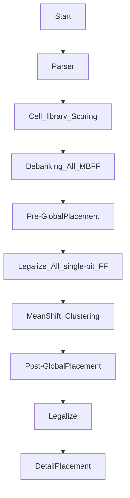

# 2024 ICCAD Problem B

## Flow Brief
*   1. Cell Library Scoring
*   2. Debanking
*   3. GlobalPlacement with slack-driven conjugate-gradient placer
*   4. Legalize Single bit flops
*   5. Bank flops with graceful meanshift algorithm
*   6. GlobalPlacement with slack-driven conjugate-gradient placer
*   7. Legalize all MBFF
*   8. DetailPlacement

## Flow Chart
Should install Markdown Preview Mermaid Support in vscode



## Usage
Install Boost Package
```
$ sudo apt-get install libboost-all-dev
$ make boost
```

Compile
```
$ make or make -j
```

Run testcase
```
$ make run1
$ make run2
$ make run3
$ make run4
$ make run5
```

Valgrind
```
$ make check
```

Cppcheck
```
$ make cppcheck
```

## Doxygen
```
$ make view_doxygen
```